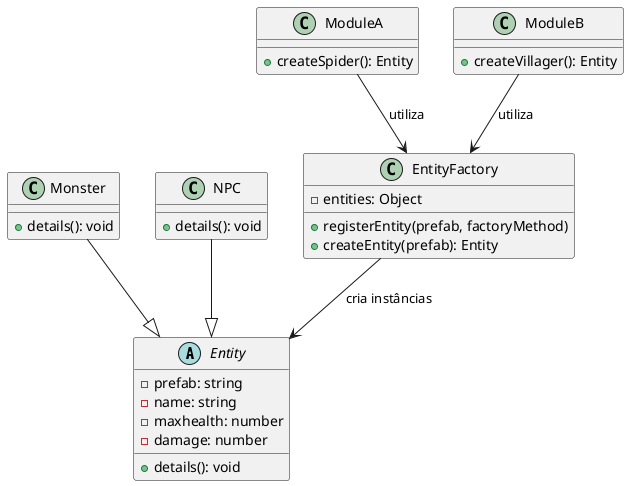
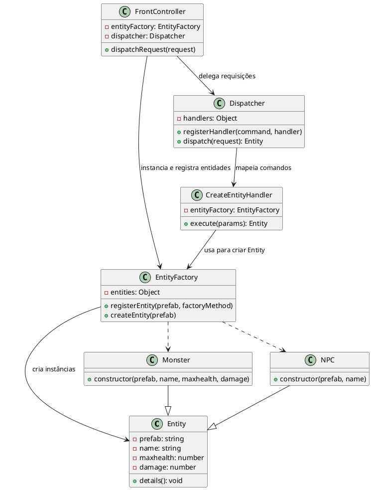

# FrontController


## Motivação
Imagine um jogo onde diversas partes do código, espalhadas em módulos distintos, são responsáveis por criar entidades como monstros, NPCs e itens. Cada módulo conhece os detalhes de como instanciar cada entidade e implementa suas próprias verificações, validações e logs. 



Utilizando o padrão Front Controller combinado com o Dispatcher, Handlers e a Entity Factory, o sistema se beneficia de uma estrutura mais organizada e modular:

O Front Controller centraliza todas as requisições. Todo o fluxo de criação de entidades passa por esse ponto único, o que garante que ações como autenticação, logging ou validação sejam aplicadas de forma consistente.

Desacoplamento:
O código cliente não precisa conhecer os detalhes de como cada entidade é criada. Basta enviar um comando (por exemplo, createEntity) com os parâmetros necessários (como o ID do prefab). O Dispatcher encaminha essa requisição para o Handler responsável, que utiliza a Entity Factory para instanciar o objeto.


## Participantes

- **FrontController (Controller):** 
Centraliza e gerencia todas as requisições relacionadas à criação de entidades (Monstros e NPCs).

- **EntityFactory (Factory):**
 Gerencia a criação de entidades baseadas em prefabs registrado

- **Monster e NPC (Products):** Representam os produtos concretos criados pela EntityFactory.

- **Dispatcher (Distribuidor de Requisições)** E ncontrar e chamar o Handler apropriado para cada requisição .

- **Handlers.**
Handler (Manipulador de Requisições)

Cada handler é responsável por executar uma ação específica.


## Exemplo de Código

### Classe Entity (Abstração)

```js

class Entity {
    constructor(prefab, name, maxhealth, damage) {
        this.prefab = prefab;
        this.name = name;
        this.maxhealth = maxhealth;
        this.damage = damage;
    }

    details() {
        console.log(`[Log] ${this.prefab} information:
  name: ${this.name}
  maxhealth: ${this.maxhealth}
  damage: ${this.damage}`);
    }
}

class Monster extends Entity {
    constructor(prefab, name, maxhealth, damage) {
        super(prefab, name, maxhealth, damage);
    }
}

class NPC extends Entity {
    constructor(prefab, name) {
        super(prefab, name, 100, 0);
    }
}


class EntityFactory {
    constructor() {
        this.entities = {};
    }

    registerEntity(prefab, factoryMethod) {
        console.log(`[Log] New Entity Registered: ${prefab}`);
        this.entities[prefab] = factoryMethod;
    }

    createEntity(prefab) {
        if (!this.entities[prefab]) {
            console.error(`[Error] No entity registered for: ${prefab}`);
            return null;
        }
        console.log(`[Log] Instantiating New Entity: ${prefab}`);
        return this.entities[prefab]();
    }
}


class CreateEntityHandler {
    constructor(entityFactory) {
        this.entityFactory = entityFactory;
    }

    execute(params) {
        const [prefab] = params;
        return this.entityFactory.createEntity(prefab);
    }
}


class Dispatcher {
    constructor() {
        this.handlers = {};
    }

    registerHandler(command, handler) {
        this.handlers[command] = handler;
    }

    dispatch(request) {
        const { command, params } = request;
        const handler = this.handlers[command];
        if (handler) {
            return handler.execute(params);
        } else {
            console.error(`[Dispatcher] Unknown command: ${command}`);
            return null;
        }
    }
}

class FrontController {
    constructor() {
        this.entityFactory = new EntityFactory();

        this.entityFactory.registerEntity('spider', () => new Monster("spider", "Spider", 100, 20));
        this.entityFactory.registerEntity('spider_warrior', () => new Monster("spider_warrior", "Spider Warrior", 200, 40));
        this.entityFactory.registerEntity('npc_villager', () => new NPC("npc_villager", "Villager"));

        this.dispatcher = new Dispatcher();
        this.dispatcher.registerHandler('createEntity', new CreateEntityHandler(this.entityFactory));
    }

    dispatchRequest(request) {
        console.log(`[FrontController] Received request: ${JSON.stringify(request)}`);
        return this.dispatcher.dispatch(request);
    }
}


const frontController = new FrontController();

const spider = frontController.dispatchRequest({ command: 'createEntity', params: ['spider'] });
const spiderWarrior = frontController.dispatchRequest({ command: 'createEntity', params: ['spider_warrior'] });
const villager = frontController.dispatchRequest({ command: 'createEntity', params: ['npc_villager'] });

console.log('Single Monster:', spider);
console.log('Spider Warrior:', spiderWarrior);
console.log('Villager NPC:', villager);

```


## Conclusão
A combinação do padrão Front-Controller com a Entity-Factory proporciona uma arquitetura flexível e escalável para o gerenciamento de entidades. O Front-Controller centraliza as requisições e delega as ações, enquanto a Entity-Factory encapsula a lógica de criação dos objetos, facilitando a manutenção e extensão do sistema sem alterar o código cliente.
