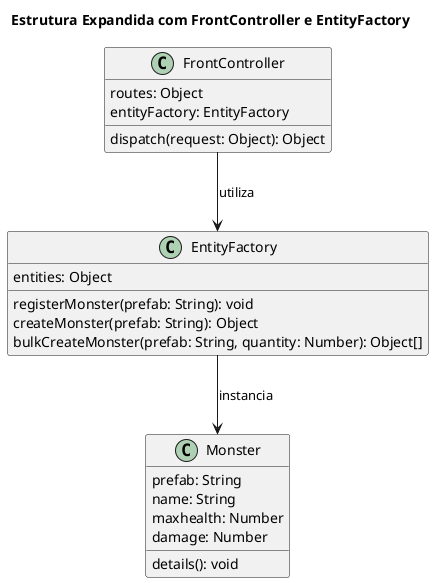

# FrontController

## O que é
O FrontController é um padrão de design utilizado para centralizar o controle de requisições em um único ponto de entrada. Em vez de cada parte do sistema lidar diretamente com a criação e manipulação de entidades, todas as solicitações passam por um controlador central, que decide para onde encaminhá-las.

## Motivação
Imagine um sistema de gerenciamento de entidades (monstros) em um jogo onde as requisições para criar ou instanciar monstros são centralizadas por um único ponto de entrada. O padrão FrontController permite concentrar o controle de requisições em um único objeto, enquanto a EntityFactory gerencia a criação de objetos específicos (no caso, monstros) com base em prefabs. Dessa forma, o código cliente não precisa conhecer os detalhes de como cada monstro é instanciado, bastando enviar um comando e os parâmetros necessários.


## Participantes

### FrontController (Controller)
- Centraliza o controle das requisições, mapeando comandos para funções específicas de criação de criaturas.
- Possui um objeto routes que associa cada comando a um método da EntityFactory.
- O método dispatch(request) recebe um objeto de requisição, extrai o comando e seus parâmetros e os encaminha para o método apropriado.


### EntityFactory (Factory)
- Gerencia a criação de monstros com base em prefabs pré-definidos.
- Possui um objeto entities que mapeia cada prefab a uma função responsável por instanciar o monstro correspondente.
- O método createMonster cria um novo monstro a partir do prefab solicitado, enquanto bulkCreateMonster permite criar múltiplas instâncias de uma vez.
- Registra novos monstros dinamicamente se o prefab solicitado ainda não estiver registrado.


### Monster (Product)
- Representa a entidade monstro, contendo atributos como prefab, name, maxhealth e damage.
- Possui o método details para exibir informações sobre o monstro, facilitando o debug e a visualização dos atributos.


## Exemplo de Código

### Classe EntityFactory

```js
class EntityFactory {
    constructor() {
        this.entities = {};
    }

    handlePrefabs = {
        spider: () => new Monster("spider", "Spider", 100, 20),
        spider_warrior: () => new Monster("spider_warrior", "Spider Warrior", 200, 40),
        spider_hider: () => new Monster("spider_hider", "Cave Spider", 600, 20)
    }

    registerMonster(prefab) {
        console.log(`[Log] New Entity Registered: ${prefab}`);
        this.entities[prefab] = this.handlePrefabs[prefab];
    }

    createMonster(prefab) {
        if (!this.entities[prefab]) {
            this.registerMonster(prefab);
        }
        console.log(`[Log] Instantiating New Entity: ${prefab}`);
        let newEntity = {};
        newEntity.source = this.entities[prefab]();
        newEntity.health = newEntity.source.maxhealth;
        return newEntity;
    }

    bulkCreateMonster(prefab, quantity) {
        let monsters = [];
        for (let i = 0; i < quantity; i++) {
            monsters.push(this.createMonster(prefab));
        }
        return monsters;
    }
}
```

### Classe Monster
```js
class Monster {
    constructor(prefab, name, maxhealth, damage) {
        this.prefab = prefab;
        this.name = name;
        this.maxhealth = maxhealth;
        this.damage = damage;
    }

    details() {
        console.log(`[Log] ${this.prefab} information:
            name: ${this.name}
            maxhealth: ${this.maxhealth}
            damage: ${this.damage}`);
    }
}
```

### Classe FrontController

```js
class FrontController {
    constructor() {
        this.entityFactory = new EntityFactory();

        this.routes = {
            'createMonster': this.entityFactory.createMonster.bind(this.entityFactory),
            'bulkCreateMonster': this.entityFactory.bulkCreateMonster.bind(this.entityFactory)
        };
    }

    dispatch(request) {
        const { command, params } = request;
        if (this.routes[command]) {
            return this.routes[command](...params);
        } else {
            console.error(`[FrontController] Unknown command: ${command}`);
        }
    }
}
``` 

### Demonstração (Client)
```js
const frontController = new FrontController();

const spider = frontController.dispatch({ command: 'createMonster', params: ['spider'] });
const spiderWarrior = frontController.dispatch({ command: 'createMonster', params: ['spider_warrior'] });
const spiderHider = frontController.dispatch({ command: 'createMonster', params: ['spider_hider'] });

const bulkSpiders = frontController.dispatch({ command: 'bulkCreateMonster', params: ['spider', 6] });

console.log('Single Monster:', spider);
console.log('Spider Warrior:', spiderWarrior);
console.log('Spider Hider:', spiderHider);
console.log('Bulk Spiders:', bulkSpiders);
```


## Conclusão
A combinação do padrão FrontController com a EntityFactory proporciona uma arquitetura flexível e escalável para o gerenciamento de entidades. O FrontController centraliza as requisições e delega as ações, enquanto a EntityFactory encapsula a lógica de criação dos objetos, facilitando a manutenção e extensão do sistema sem alterar o código cliente.
