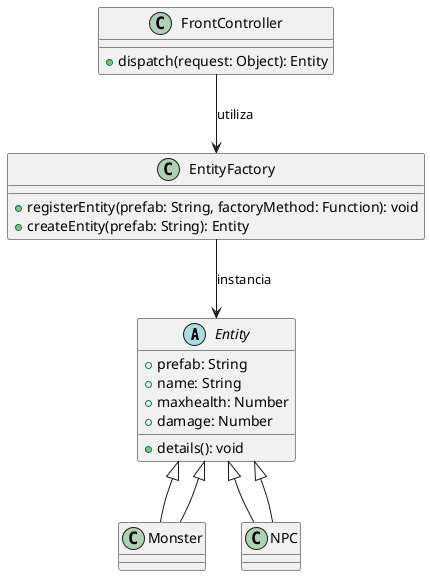

# FrontController

## O que é
O FrontController é um padrão de design utilizado para centralizar o controle de requisições em um único ponto de entrada. Ele é especialmente útil em sistemas onde o cliente faz uma solicitação sem saber qual classe específica atenderá a requisição.

## Motivação
Imagine um sistema de gerenciamento de entidades em um jogo onde as requisições para criar ou instanciar objetos são centralizados por um único ponto de entrada. O padrão Front-Controller permite concentrar o controle de requisições em um único ponto, enquanto a Entity-Factory gerencia a criação de objetos específicos com base em prefabs (IDs, etc). Dessa forma, o código cliente não precisa conhecer os detalhes de como cada entidade é instanciada, bastando enviar um comando e os parâmetros necessários.


## Participantes

### FrontController (Controller)
- Centraliza o controle das requisições, mapeando comandos para funções específicas de criação de criaturas.
- Possui um objeto routes que associa cada comando a um método da EntityFactory.
- O método dispatch(request) recebe um objeto de requisição, extrai o comando e seus parâmetros e os encaminha para o método apropriado.


### EntityFactory (Factory)
- Gerencia a criação de monstros com base em prefabs pré-definidos.
- Possui um objeto entities que mapeia cada prefab a uma função responsável por instanciar o monstro correspondente.
- O método createMonster cria um novo monstro a partir do prefab solicitado, enquanto bulkCreateMonster permite criar múltiplas instâncias de uma vez.
- Registra novos monstros dinamicamente se o prefab solicitado ainda não estiver registrado.


### Monster (Product)
- Representa a entidade monstro, contendo atributos como prefab, name, maxhealth e damage.
- Possui o método details para exibir informações sobre o monstro, facilitando o debug e a visualização dos atributos.


## Exemplo de Código

### Classe Entity (Abstração)

```js
class Entity {
    constructor(prefab, name, maxhealth, damage) {
        this.prefab = prefab;
        this.name = name;
        this.maxhealth = maxhealth;
        this.damage = damage;
    }

    details() {
        console.log(`[Log] ${this.prefab} information:
            name: ${this.name}
            maxhealth: ${this.maxhealth}
            damage: ${this.damage}`);
    }
}
```

### Classe Monster
```js
class Monster extends Entity {
    constructor(prefab, name, maxhealth, damage) {
        super(prefab, name, maxhealth, damage);
    }
}
```

### Classe NPC
```js
class NPC extends Entity {
    constructor(prefab, name) {
        super(prefab, name, 100, 0);
    }
}
```

### Classe Entity-Factory
```js
class EntityFactory {
    constructor() {
        this.entities = {};
    }

    registerEntity(prefab, factoryMethod) {
        console.log(`[Log] New Entity Registered: ${prefab}`);
        this.entities[prefab] = factoryMethod;
    }

    createEntity(prefab) {
        if (!this.entities[prefab]) {
            console.error(`[Error] No entity registered for: ${prefab}`);
            return null;
        }
        console.log(`[Log] Instantiating New Entity: ${prefab}`);
        return this.entities[prefab]();
    }
}
```

### Classe Front-Controller

```js
class FrontController {
    constructor() {
        this.entityFactory = new EntityFactory();
        
        this.entityFactory.registerEntity('spider', () => new Monster("spider", "Spider", 100, 20));
        this.entityFactory.registerEntity('spider_warrior', () => new Monster("spider_warrior", "Spider Warrior", 200, 40));
        this.entityFactory.registerEntity('npc_villager', () => new NPC("npc_villager", "Villager"));
    }

    dispatch(request) {
        const { command, params } = request;
        if (command === 'createEntity') {
            return this.entityFactory.createEntity(params[0]);
        } else {
            console.error(`[FrontController] Unknown command: ${command}`);
        }
    }
}
``` 

### Demonstração (Client)
```js
const frontController = new FrontController();

const spider = frontController.dispatch({ command: 'createEntity', params: ['spider'] });
const spiderWarrior = frontController.dispatch({ command: 'createEntity', params: ['spider_warrior'] });
const villager = frontController.dispatch({ command: 'createEntity', params: ['npc_villager'] });

console.log('Single Monster:', spider);
console.log('Spider Warrior:', spiderWarrior);
console.log('Villager NPC:', villager);
```


## Conclusão
A combinação do padrão Front-Controller com a Entity-Factory proporciona uma arquitetura flexível e escalável para o gerenciamento de entidades. O Front-Controller centraliza as requisições e delega as ações, enquanto a Entity-Factory encapsula a lógica de criação dos objetos, facilitando a manutenção e extensão do sistema sem alterar o código cliente.
